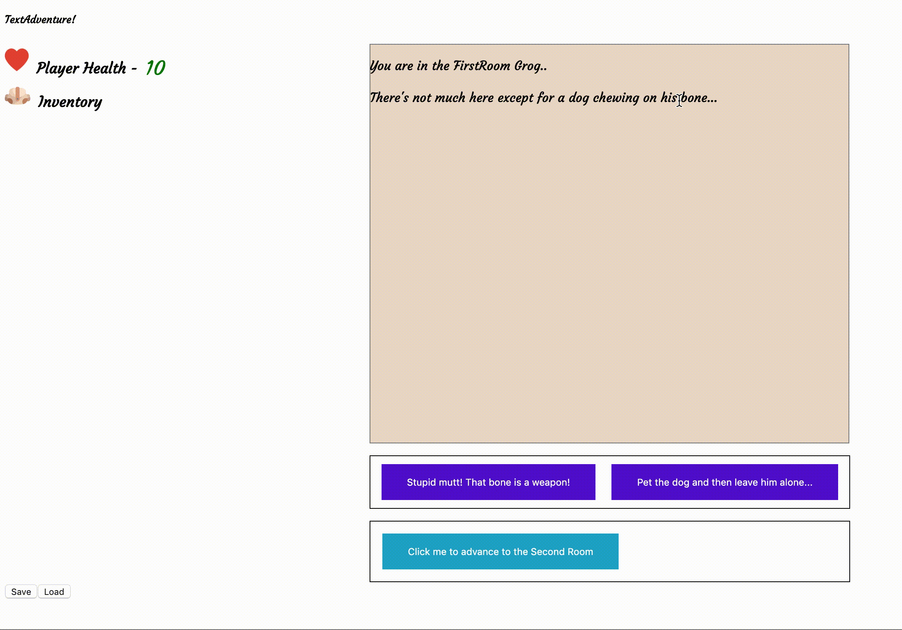

# Introduction - TextAdventure

TextAdventure is a text adventure game where you play as a lowly goblin trying to escape from his oafish human masters.

# What does the app do?

In this game, you play a character trying to make it to the final boss room. Along the way you can pick up weapons, consumable items and make choices that will effect the final ending.

This game comes with fight scenes against monsters. You can attack and defeat these monsters, but beware - if you are ill equipped you will likely lose!

This game has a save/load function if the correct password is entered into the Mongo connection string. You can save your files, but only the first load save is currently returned.

# User Stories

The player can enter in their name and have it displayed in the text

Player has an HP value that can be modified

Player has an inventory that can store/show items

Player has an attack value that can be modified by equipping weapons

The player can fight enemies

The player is shown a game over screen if they die

The user can navigate between multiple rooms

The user can make decisions that will have consequences later on

The player can save their game, and load a game

# Tech-Stack

React/Redux

# Back-End

Express
MongoAtlas

# Get started

Take the following steps to run the app in your localhost, you will need to have the following:

A MongoDB Atlas cluster must be set up, and the appropriate cluster URI and password must be added to the db/index.js file, and the password must be modified in the pw.js file. You can run the game without this, but the save/load features will not work.

From terminal in the index folder:

npm install
npm start

# Challenges

This was my first time with Redux, and setting up all the boilerplate was challenging. In addition, I ran into issues when I wanted to update multiple parts of state at once.

# Learnings

I learned a lot about how combineReducers/Redux architecture works. I learned that you should try to seperate every "slice" of state to its own reducer.
